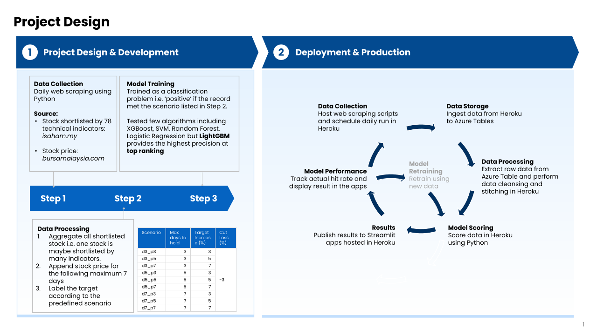

# Screener For Short Term Trading
Hello!

The premise behind this screener is simple. We extract all the Bursa Malaysia stocks shortlisted by the freely available technical indicators, 
and find the best possible combination which high chance of percentage increase within the specified time windows, without ever meeting the 
cut loss percentage of -3%.  

The app can be accessed [here](https://stock-screener-amirul-0e3d96487623.herokuapp.com/). 

I hope it is as useful to you as much as the fun I'm having developing it. 

Thank you.

&nbsp;  &nbsp;  &nbsp;  &nbsp;  &nbsp;  &nbsp;  &nbsp;  &nbsp;  &nbsp;

**Disclaimer**

This stock screener tool is provided solely for personal and educational purposes. It is not intended, nor should it be considered, as a source of financial advice or a tool for making investment decisions. The information and data presented by this stock screener are for informational purposes only and should not be used as a basis for any financial actions.
